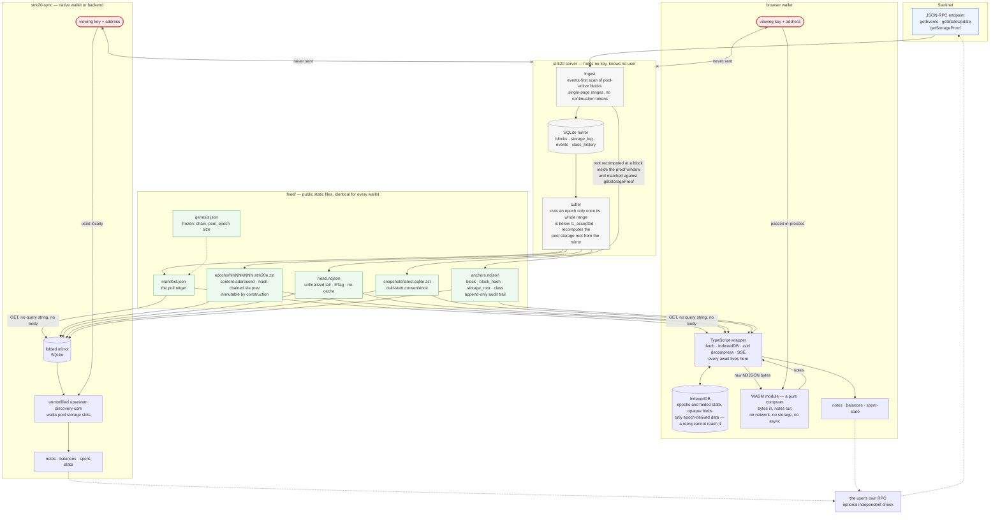

# Dataflow — chain to wallet, and where the viewing key stops

One diagram for the whole read path: how chain data becomes public static files,
how a wallet turns those files into its own notes, and which arrows the viewing
key is allowed on.

Read the two crossed lines first. They are the product.

## How to read it

- **Crossed line (`x—x`) = this never happens.** The viewing key and the address
  never reach the server, in any encoding. That is asserted mechanically in CI by
  a byte-scanner over a full proxy capture, and it was re-checked on live Sepolia
  traffic: two wallets, one holding a real key that finds a note and one holding
  an unrelated key that finds nothing, produced **byte-identical request
  streams** — 609 requests, 64,509 bytes each.
- **Solid arrow = bytes actually move.** Everything the wallet fetches is a
  public static file with no query string and no request body: `genesis.json`,
  `manifest.json`, and a sequence of `epochs/…zst`, plus `head.ndjson` and
  `anchors.ndjson`. Because every wallet requests the same files in the same
  order, the request stream carries no information about who is asking.
- **Dashed arrow = optional or metadata.** The user's own RPC is the one path
  that grounds the feed in the chain without trusting us: `strk20-sync verify`
  proves each discovered note and its spent-state against Starknet state roots,
  with the indexer entirely out of the trust path.

## The two halves of the client

The engine is the same in both, and it is upstream's own `discovery-core`,
consumed unmodified.

| | native | browser |
|---|---|---|
| fetching, decompression, storage, every `await` | Rust client | **TypeScript wrapper** |
| folding + discovery | Rust client | **WASM: bytes in, notes out** |
| persistence | SQLite mirror | IndexedDB blobs |
| reorg handling | rewind above the epoch floor | **none needed** — only epoch-derived state is persisted, and epochs are cut below `l1_accepted` |

`zstd` decompression stays in TypeScript (`zstd-sys` does not build for
`wasm32`), so the module receives raw NDJSON and the compressed file's hash is
checked before decompression. Keeping WASM synchronous and storage-free is what
keeps the engine's `Send` bounds satisfiable and the module testable.

## Why the arrows into `feed/` are shaped that way

- An epoch is cut **only when its entire block range is at or below
  `l1_accepted`**, which makes epochs immutable by construction: a reorg can
  never reach one. Only `head.ndjson`, the unfinalized tail, is ever rewritten.
- Epoch payload bytes are a deterministic function of chain data, so every honest
  mirror produces byte-identical epochs, and each one names its predecessor's
  hash. An omitted or altered block is therefore a **visible fork**, not a silent
  difference.
- `anchors.ndjson` is written only when the mirror's recomputed pool storage root
  equals the root in a `starknet_getStorageProof` response for that block. A
  failure to capture an anchor is never a mirror alarm; a mismatch is.

Sources: [`docs/spec/architecture.md`](../spec/architecture.md) §4.2–4.4,
[`docs/spec/consumer-path.md`](../spec/consumer-path.md) §11,
[`docs/research/live/live-run-findings.md`](../research/live/live-run-findings.md)
sessions 5 and 8.
