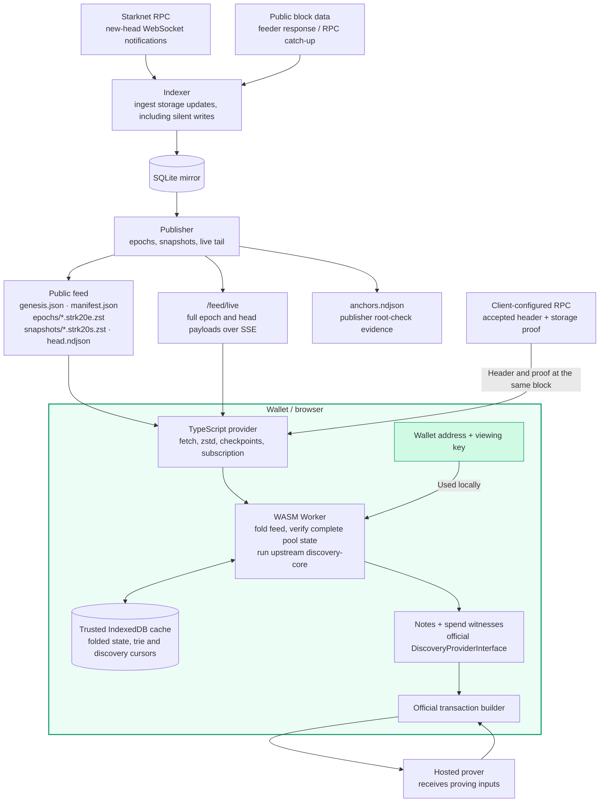

# Dataflow — public feed, local discovery

The browser SDK is the main integration path. The viewing key reaches the local
Worker, not the indexer. Checkpoint verification is required before discovery
returns verified state; a previously verified local cache is explicitly trusted.

- Production ingestion wakes on new-head events. It then obtains the public
  block data needed to update the mirror; a header notification alone does not
  contain storage diffs. Publication wakes SSE subscribers directly.
- A cold browser start loads the public snapshot and subsequent data, acquires
  an independent checkpoint, verifies complete pool state and saves it before
  reporting readiness. Compressed artifact hashes are checked before decoding.
- A warm start restores the verified cache locally. Subsequent SSE updates are
  checked against new checkpoints; missed data triggers HTTP catch-up. The cache
  includes the live tail and supports rewind; it is not limited to finalized epochs.
- The proof must bind to the accepted RPC header's block hash and global state
  commitment. Failed verification cannot replace the previously verified state.
  This checks state at one block, not every historical write or Ethereum finality.
- `anchors.ndjson` records publisher checks. The browser obtains its own proof;
  it does not treat publisher anchors as its trust root. Publisher MISMATCH stops
  publication, while an unavailable proof is a distinct condition.
- Feed requests contain no viewing key or wallet address. Public data does not
  imply anonymous transport: the host can still observe IP, timing and requested
  ranges. Different caches and start times can produce different request sequences.
- The native `strk20-sync` client retains a SQLite store and its SSE/polling
  compatibility path. This is separate from the browser's Worker/IndexedDB path.
- The optional official comparison sends the viewing key to the reference service
  only after the demo's explicit opt-in. Hosted proving is a separate trust boundary.

See [consumer contract](../spec/consumer-path.md),
[SDK API](../../ts/strk20-discovery/README.md),
[demo and live evidence](../spec/demo-app.md), and [hosting](../ops/hosting.md).
