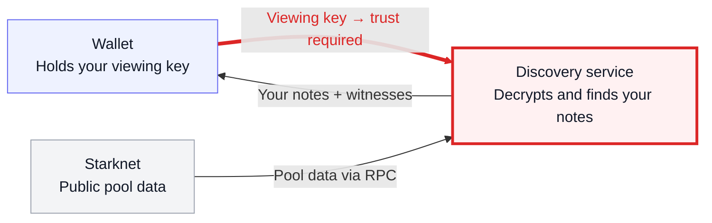
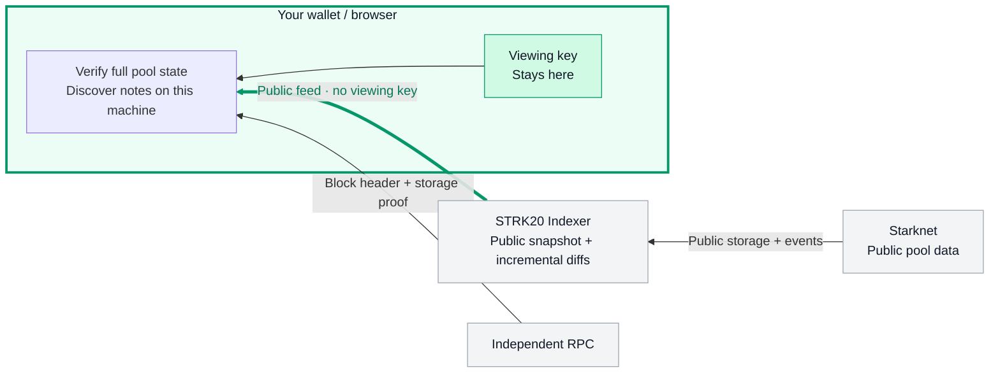

# STRK20 Indexer — сценарий демо-видео

Формат: **две карточки со схемами → живое демо одним непрерывным дублем**.
Цель по длительности: 2–3 минуты. Без склеек, ускорения и заключительной карточки.
Речь — на английском; указания к записи — по-русски. Тайминг ниже — план для
репетиции, а не измеренная длительность будущего прогона.

## Карточки

### 1. Проблема: “Private notes. A shared viewing key.”

Слева кошелёк, в центре discovery service, справа Starknet. Красная стрелка —
**viewing key пересекает границу кошелька**. Красная подпись под сервисом:
**“Who do you trust to see your notes?”** Это главный акцент карточки.

Для финального оформления: три крупных блока, минимум текста; у красной стрелки
значок ключа и вопросительный знак. Не добавлять путь отправки транзакции:
здесь объясняется именно **discovery**.

Точность схемы: официальный сервис получает viewing key в запросе, читает
публичные данные через RPC и возвращает найденные ноты и данные для их расходования.
По его документации ключ не сохраняется между запросами — проблема в необходимости
доверить ему ключ и расшифровку, а не в утверждении, что он ключи хранит или публикует.
Viewing key не следует изображать как ключ подписи, позволяющий потратить средства.

### 2. Решение: “Public feed. Local discovery.”

Те же позиции: кошелёк слева, наш индексер в центре, Starknet справа. Теперь через
границу идёт **публичный feed**, а ключ и поиск нот находятся внутри кошелька.
Главная подпись: **“The discovery server never receives your viewing key.”**

Небольшой блок RPC — под основной линией, без подробностей устройства доказательств.
В кошельке достаточно двух строк: **“Verify locally” / “Find my notes”** и значка ключа.
Не называть решение полностью trustless: клиент доверяет выбранному RPC и своему
локальному кэшу. При одинаковом кэше и целевом блоке запросы публичных данных
не зависят от viewing key и принадлежности нот. Это не обещание анонимности IP
или одинакового сетевого трафика при разных кэшах и времени подключения. Это замена discovery-пути; hosted prover остаётся отдельным сервисом.

## Что показываю и что говорю

### 0:00–0:22 — первая карточка

**Экран:** схема проблемы. Указателем пройти от кошелька по красной стрелке к сервису.

> STRK20 makes token transfers private. But to find your private notes through the standard discovery service, your wallet sends it a viewing key. The service can then decrypt and identify your notes. So private funds still come with a trust decision: who gets to see them?

### 0:22–0:50 — вторая карточка

**Экран:** схема решения. Показать публичный feed, затем ключ внутри кошелька.
После этого перейти в уже подготовленную вкладку демо.

> My solution processes the full public pool state on the client, rather than asking a server for my wallet’s slots. Everyone uses the same public snapshot and diffs. Requests do not depend on the viewing key or which notes belong to you. Verification and discovery run entirely on your machine. Here it is on Starknet mainnet.

### 0:50–1:15 — тёплая загрузка

**Экран:** mainnet-демо с заранее прогретым кэшем. Перезагрузить страницу в кадре,
дождаться восстановления, показать приватный баланс и номер проверенного блока.
Не очищать данные браузера. Ожидание оставить целиком.

> The snapshot has already been processed and saved. Reloading restores the verified state and discovery progress. Catch-up applies only the missing diffs; it does not replay the snapshot. The block number shows which state has been verified.

### 1:15–2:00 — локальный discovery

**Экран:** вызвать discovery текущей доступной кнопкой. После завершения показать
найденный баланс и раскрыть нужную операцию в Activity. Сравнение с официальным
сервисом оставить выключенным: оно отправляет ему viewing key.

> Now I refresh discovery. The feed sends incremental public updates. A browser Worker applies them, verifies the complete pool state against an independent RPC checkpoint, and finds my notes locally. The result fits the official discovery interface and works with the existing transaction builder.

### 2:00–2:40 — результат в демо

**Экран:** остаться в демо. Показать результат локального поиска, блок и детали
проверки. Если на репетиции выбран сценарий с новой приватной транзакцией, показать
её подтверждение и последующий discovery здесь; длительность ожидания учитывать
целиком. Не пытаться втиснуть новый полный цикл shield → transfer → withdraw.

> The mainnet flow has already completed: shield, local discovery, private transfer and withdrawal. This demo uses our discovery provider with the official transaction builder. The privacy change is specific: discovery keeps the viewing key local. The hosted prover still receives proving inputs.

Закончить на экране результата. Отдельного слайда, призыва, перечня технологий или
экскурсии по исходному коду в конце нет. Действия внутри демо — пока рабочий черновик;
окончательный порядок уточняется после самостоятельного прогона автором.

## Подготовка непрерывного дубля

- Подготовить кошелёк с приватной нотой и один раз дождаться полной инициализации и
  сохранения кэша **до записи**. После завершённого предыдущего цикла приватный
  баланс равен нулю: не выдавать его за демонстрацию найденной непотраченной ноты.
- Использовать тот же браузер, профиль, origin и сеть. Не открывать incognito и не
  сбрасывать кэш. Первый холодный запуск в этот сценарий не входит.
- Провести полный пробный дубль с секундомером. Если он длиннее трёх минут,
  сократить речь или число действий до записи; не вырезать ожидания из результата.
- Укрупнить интерфейс, скрыть лишние панели. Не показывать backup или ключи.
- Не включать сравнение с официальным сервисом. Не обещать универсальное ускорение
  или криптографическое доказательство полной истории транзакций.

## Фактическая основа — за кадром

Завершённый mainnet-цикл, а не утверждение, что все три операции выполняются в этом
трёхминутном дубле:

- [Shield](https://voyager.online/tx/0x3e09c1a8a09bf2a146bbd452fed3c48309b7124c7be4745056742ec1653bc59).
- [Private transfer](https://voyager.online/tx/0x1df98fdd1cc335d5bfa9c39b4bcc55ae4cbc02a3ce389e14e3a6dcec2d8b5a3).
- [Withdrawal](https://voyager.online/tx/0x69ea91064cb35315d311493cac956439bf3e0bbe798c95248c7cc437802ef1f).
- [Условия прогона и измерения](spec/demo-app.md#funded-mainnet-cycle-completed-2026-09-07).
- [Официальный discovery service: ключ в запросе, обработка и отсутствие хранения](https://github.com/starkware-libs/starknet-privacy/blob/main/crates/discovery-service/README.md).
