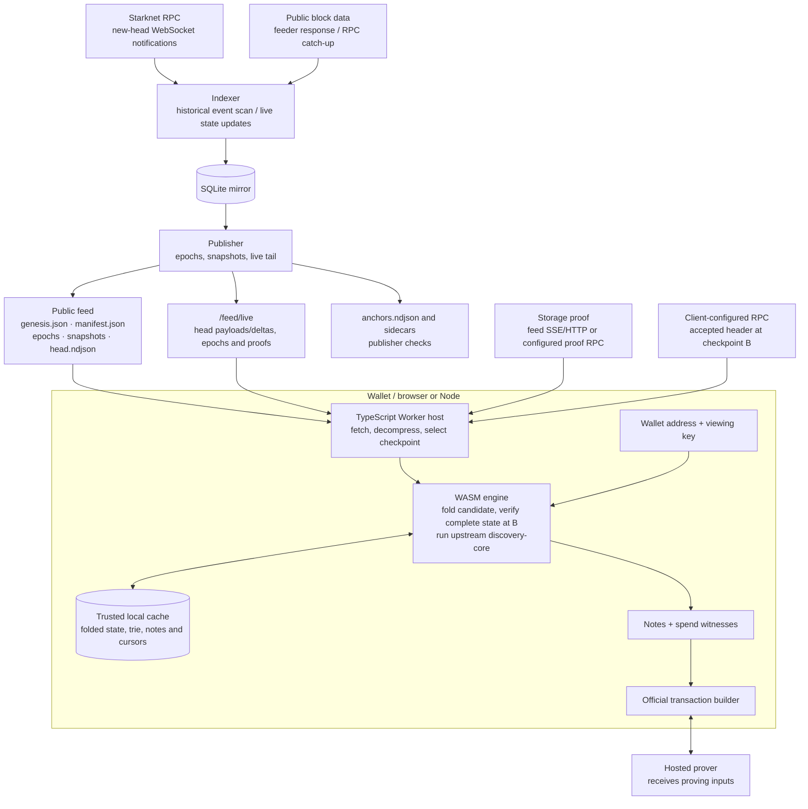

# Architecture

The indexer publishes public STRK20 pool data. Wallets download it and run the
upstream discovery engine locally; feed requests contain neither a viewing key
nor a wallet address. The browser and Node provider's verification contract is
in [Consumer path](consumer-path.md), with integration examples in the
[SDK README](../../ts/strk20-discovery/README.md).

## Components and dependencies

| Component | Responsibility |
|---|---|
| [`strk20-feed`](../../crates/feed/src/lib.rs) | Canonical feed codecs, hashes, snapshots, Patricia trie and checkpoint proof verification. |
| [`strk20-indexerd`](../../crates/indexerd/src/lib.rs), binary `strk20` | RPC ingestion, SQLite mirror, publication, HTTP service and operator commands. |
| [`strk20-consumer`](../../crates/consumer/src/lib.rs) | Host-independent feed application, folded state, discovery cursors and upstream engine adaptation. |
| [`strk20-client`](../../crates/client/src/lib.rs), binary `strk20-sync` | Native HTTP/directory transport, SQLite consumer store and CLI discovery/verification. It does not depend on the server crate. |
| [`strk20-engine`](../../crates/wasm/src/lib.rs) | Synchronous WASM facade: staged public bytes, candidate verification and cache persistence. |
| [`strk20-discovery`](../../ts/strk20-discovery/src/provider.ts) | Official `DiscoveryProviderInterface`, browser/Node Workers, public transport, checkpoints, subscriptions and local caching. |
| [`ts/demo`](../../ts/demo/src/main.ts) | Software wallet, backup, transaction orchestration and explicit official-service comparison. |
| [`e2e-tests`](../../crates/e2e-tests/Cargo.toml) | Fixture RPC/feed servers and tests of the actual binaries and shared engine. |

The consumer operates through [`ConsumerStore`](../../crates/consumer/src/store.rs)
and [`FeedTransport`](../../crates/consumer/src/transport.rs). SQLite and HTTP
belong to the native host; the WASM host supplies memory, downloaded bytes and
JavaScript decompression. The upstream `discovery-core` source is unchanged by
our [dependency-gating fork](../ops/fork.md).

Dependency versions and source pins belong to [Cargo.toml](../../Cargo.toml),
[Cargo.lock](../../Cargo.lock), and the TypeScript
[manifest](../../ts/strk20-discovery/package.json) and
[lockfile](../../ts/package-lock.json). The shared Starknet dependencies must
retain compatible `Felt` types with `discovery-core`; do not introduce a second
engine source or an incompatible types crate on a separate dependency edge.

## Data path and trust boundaries

A notification wakes ingestion; it is not a storage diff. Proof bytes may come
from the publisher, but the client checks them against an independently selected
header. Publisher anchors are diagnostics, not the browser's trust root.
The server still observes IP addresses, timing and requested public ranges;
different caches and start times need not produce identical request sequences.
The demo's [comparison and prover boundaries](demo-app.md#privacy-and-limitations)
are separate from local discovery.

## Storage and public feed

The server schema and migrations live in [`db.rs`](../../crates/indexerd/src/db.rs).
It stores block identity, per-block pool storage writes and events, class history,
ingest progress, publication metadata and recovery state. As-of reads choose the
latest write at or before the requested block, with absent storage read as zero.
The database uses SQLite WAL. The native client's schema is maintained separately
in [`store.rs`](../../crates/client/src/store.rs).

The publisher writes these artifacts beneath `--feed-dir`:

| Path | Contents and lifetime |
|---|---|
| `genesis.json` | Feed format and identity: chain, pool, deployment block and epoch size. |
| `manifest.json` | Head metadata, ordered epoch inventory, transport/content hashes, optional anchors and the newest snapshot. Replaced atomically. |
| `epochs/{e:08}.strk20e.zst` | Canonical NDJSON compressed with zstd. Epoch ranges are aligned to `e * epoch_size`; normal publication never rewrites them. |
| `epochs/{e:08}.anchor.json` | Optional RPC proof sidecar for the epoch end block. |
| `head.ndjson` | Mutable tail above the last cut epoch, including head hash and accepted-on-L1 height. Replaced atomically. |
| `anchors.ndjson` | Ordered publisher root-check records, rebuilt from the database. |
| `snapshots/{e:08}.strk20s.zst` | Folded nonzero storage at an epoch boundary, with last-write metadata and a link to its basis epoch. |
| `snapshots/{e:08}.anchor.json` | Optional proof at the snapshot basis block. |

`{e:08}` means a decimal epoch index padded to at least eight digits. Epochs
contain a header, ordered block/storage/event records and a footer; their SHA-256
content hash covers the uncompressed canonical bytes and chains to the previous
epoch. The separate `zst` hash identifies compressed transport bytes. Proof
sidecars and manifest anchors are outside this hash chain. Exact formats live in
[`codec.rs`](../../crates/feed/src/codec.rs),
[`manifest.rs`](../../crates/feed/src/manifest.rs),
[`snapshot.rs`](../../crates/feed/src/snapshot.rs) and
[`anchors.rs`](../../crates/feed/src/anchors.rs).

Hashes detect changes relative to the selected manifest and cached chain. They
do not make an incomplete or fabricated feed authentic. Snapshot hashes and
publisher-provided roots likewise cannot replace checkpoint verification.

## Ingestion and reorgs

[`ingest.rs`](../../crates/indexerd/src/ingest.rs) owns both ingestion paths.
Startup checks the RPC chain, pool deployment and stored configuration identity.
The supported network profiles and class allowlists live in
[`config.rs`](../../crates/indexerd/src/config.rs).

For a large historical gap, ingestion scans `getEvents` in bounded segments and
fetches each named block's header and state update. Scan windows subdivide until
the reply fits one page; continuation tokens are never reused. A one-block window
that still returns a token is an error, not permission to truncate. Completed
segments checkpoint progress so interruption does not require starting over.
This path cannot name a block that changes pool storage without a pool event.
An event-count audit has the same limitation.

For gaps within `TAIL_STATE_DIFF_SPAN`, ingestion examines every block's state
update, including eventless pool writes. A configured feeder can supply the
announced block, receipts and state diff together; gaps use RPC. Header, update,
events and subscription identity must agree before storage. The ingest frontier
advances only after the range's updates have been processed. Unknown classes
preserve raw ingestion and feed data but mark typed decoding as degraded; stats
and compatibility discovery are restricted accordingly.

`run` subscribes before catch-up, then wakes on new heads or feed catch-up demand.
Without `--rpc-ws-url` it uses the configured polling interval. A stored head
that no longer belongs to the chain triggers a walk back through stored blocks.
RPC transport failure is not treated as a reorg. Rollback removes abandoned rows,
cursors and anchors above the ancestor and regenerates the tail. It never crosses
the published epoch floor. Epoch cuts require their end block to be at or below
both the ingest frontier and the accepted-on-L1 height retained from RPC; rejected
finality answers do not advance that height. This relies on RPC finality labels,
not an independently verified Ethereum checkpoint.

## Verification and publication

[`cutter.rs`](../../crates/indexerd/src/cutter.rs) recomputes the complete mirrored
pool storage root at `min(ingest_frontier, RPC_head)`. The proof must name the same
block hash as the fetched header. This server check compares the reconstructed
root with the RPC proof's contract-leaf storage root; the SDK's full contract path
and global commitment verification is described in [Consumer path](consumer-path.md).

| Result | Effect |
|---|---|
| **MATCH** | Records an anchor and clears the mismatch latch and recovery record. It establishes agreement at the checked block. |
| **MISMATCH** | Latches `verify_root_failed`, aborts the current epoch-cut attempt and triggers bounded recovery. Snapshots are withheld while the latch remains set. |
| **UNAVAILABLE** | No usable proof was obtained. Does not set or clear the mismatch latch; epoch cutting may proceed without verification. |

A proof bound to another block aborts the cut without classifying the mirror as
corrupt. Other probe errors leave the frontier eligible for a later retry and do
not necessarily stop the cut. In particular, publication is not a MATCH-only gate.
`run` regenerates the live tail before cutting epochs, and continues ingestion
when a cut fails. Already published files remain accessible. Clients must verify
state themselves; HTTP success is not a verification result.

Snapshots use a basis-block proof when available. Otherwise the publisher may
use a recorded anchor at or above the basis, provided the mismatch latch is clear,
and labels this `reachability` in the manifest. This fallback is a publication
condition, not proof of every earlier write. A basis-root mismatch is an error.
Only the newest retained snapshots are kept; retention is defined by `SNAPSHOT_KEEP`.

A successful root check authenticates neither intermediate transitions nor exact
write times. Missing writes later overwritten or restored can be invisible at the
selected block. A mismatch identifies a bad state at the probe block, not the
first missing block.

## Recovery

[`recovery.rs`](../../crates/indexerd/src/recovery.rs) records one automatic
attempt until a subsequent MATCH clears it, even if the observed divergence moves
or the process restarts. The attempt is bounded by `ATTEMPT_DEADLINE`. It checks
for a reorg first, walks differing storage-trie branches, attributes missing slots
to candidate writing blocks, and re-ingests those blocks before retrying the cut.
The walk and attribution are implemented in
[`trie_walk.rs`](../../crates/indexerd/src/trie_walk.rs).

Attribution uses a nonzero-slot bisection: write-once slots fit that predicate;
mutable slots that return to zero may not. Divergent values and extra local slots
are reported but are not automatically repaired by attributing missing slots.
An unsuccessful attempt leaves an operator-visible reason and lets ingestion
resume. It does not repeatedly rescan a guessed recent window.

Operator commands are `audit-coverage`, `enumerate-slots`, `rescan`,
`recut-epochs`, `epoch-verify` and `verify-root`. Repair below the epoch floor
requires an explicit recut, which changes published history, withdraws dependent
snapshots and can require consumers to bootstrap again. Follow the backup and
[repair procedure](../ops/hosting.md#repairing-a-mirror); do not rewrite published
history merely to suppress a mismatch.

## HTTP interfaces

Routes and response shapes are implemented in
[`server.rs`](../../crates/indexerd/src/server.rs),
[`live.rs`](../../crates/indexerd/src/live.rs) and
[`compat`](../../crates/indexerd/src/compat/mod.rs).

| Interface | Contract |
|---|---|
| `GET /feed/…` | Artifacts listed above. Manifest/head/anchor log use revalidation; epoch and snapshot files use immutable caching. |
| `GET /feed/live` | Global SSE, no query parameters. Sends `hello`, `epoch`, `head`, `snapshot`, `status` and `proof` events as applicable. |
| `GET /feed/proofs/{block}` | Public proof envelope for a recent block. No query parameters; HTTP 410 outside the retained head window, 503 when acquisition is busy/unavailable. |
| `GET /health` | Head, accepted-on-L1 height, decoder state and mismatch/recovery information. HTTP 503 for `UNHEALTHY`; `DEGRADED` still returns HTTP 200. |
| `GET /v1/stats` | Aggregate decoded activity, with decoder-state limitations. |
| `GET /metrics` | Operator metrics; no public CORS. |
| `POST /v1/raw/read_slots`, `GET /v1/raw/events` | Only with `--enable-raw`; requests reveal targeted slots/filters and responses carry `X-Strk20-Privacy`. |
| `POST /v1/sync/{incoming_state,outgoing_state,preflight_check}`, `POST /v1/history` | Only with `--enable-compat`; upstream-compatible wire handlers, with viewing keys processed on the server. |

SSE connection startup sends the current full head and latest epoch when within
payload limits. When the head record prefix is unchanged, updates can carry
`delta: {base_etag, header, append, end}` with `payload: null`. Header/trailer
newlines are retained and `append` holds complete NDJSON records. Deltas are based
on the last state sent on that connection, including coalesced publications.
Reconnects, changed prefixes and epoch rollover use a full head. Oversized
payloads signal HTTP catch-up. Event IDs hash event content; there is no durable
replay journal or per-wallet subscription cursor. Clients assemble every delta
before coalescing verification work, as specified in [Consumer path](consumer-path.md).

Public read routes provide CORS and conditional file reads. Raw/compat routes are
disabled by default and do not inherit that public CORS policy. Deployment
allowlists, volumes and health checks belong in [Hosting](../ops/hosting.md).
